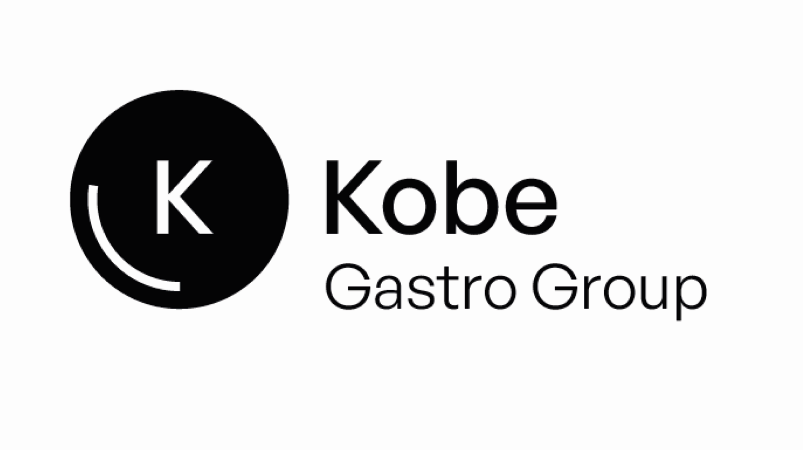
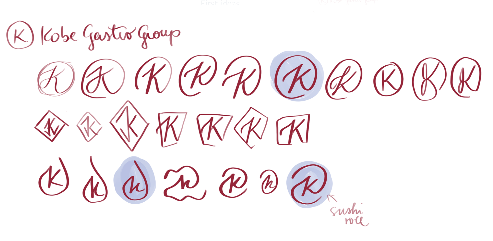
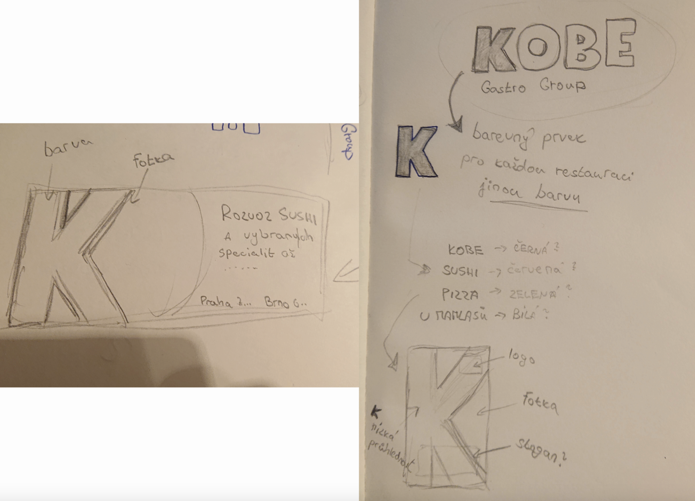
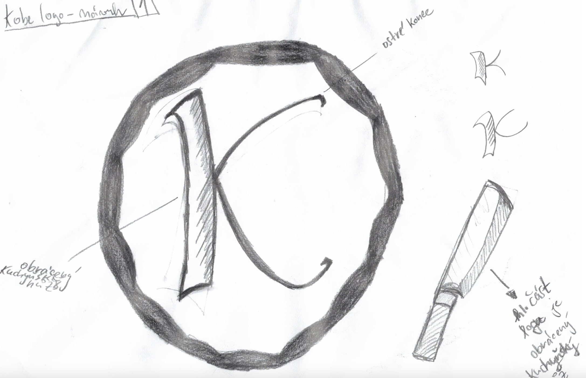
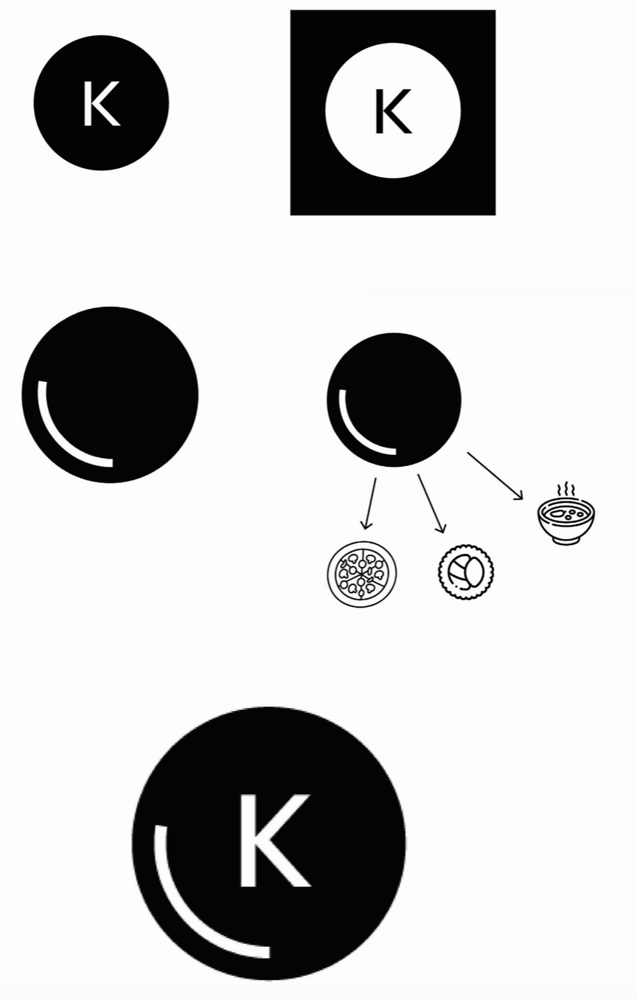
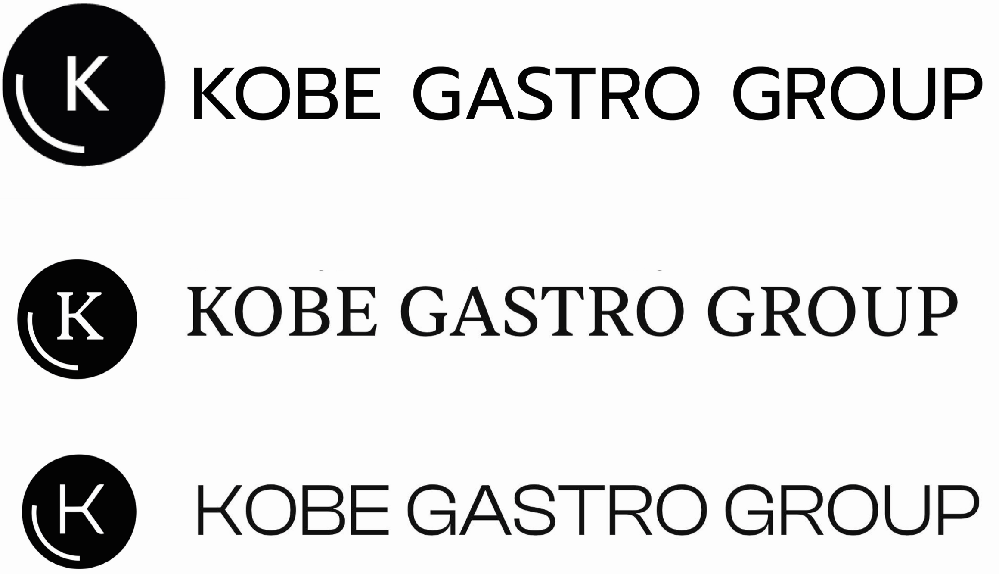
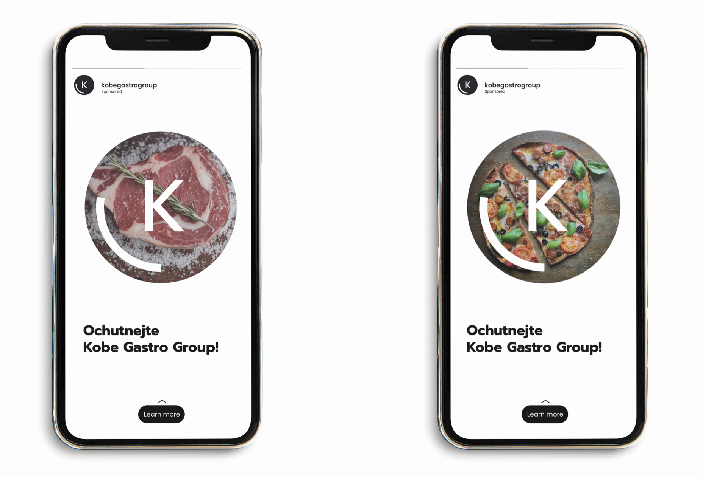
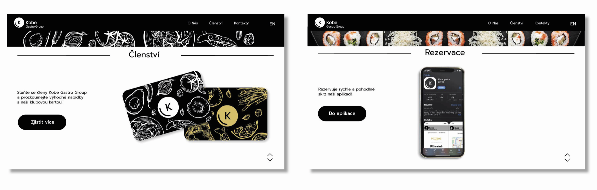

# My case study
## KOBE GASTRO GROUP

### KOBE GASTRO GROUP

We received the KOBE GASTRO GROUP project as a group at the VSKK University. In the number of 5 people, we created a new logo for the main brand of several restaurants and competed with other teams from the school. First, we started researching how other umbrella restaurants look. After consulting with the project leader teachers, we created the first designs. I present you our logo from basic sketches

#### First ideas

 One of the most important things is the representing element of the KOBE GASTRO GROUP. That's why we started with it immediately after research.
 

There were a lot of failed attempts behind it and also struggles in a team but we always found a way how do things with respect.

#### The final element
In the final, we decided to make a circular shape of main element that represents a plate and that's a representative symbol of each of the
KOBE GASTRO GROUP restaurants, which differ from each other in style and cuisine. This element of the plate unites all restaurants.

#### Logo typography
 After consulting with the client and our school project leaders, we agreed on a round element of the logo but the font still wasn't alright. That's why we chose from several variants and font styles that would represent the brand best.
 

 
#### Final logo
For the final logo, we decided to choose the GENERAL SANS font, which seemed modern to us, clean and at the same time does not evoke any kitchen style, because of it it can be a umbrella brand for several different restaurants.

#### Visualization
We agreed with the client on the element and the logo and for better understanding to our vision we made these visuals. 

