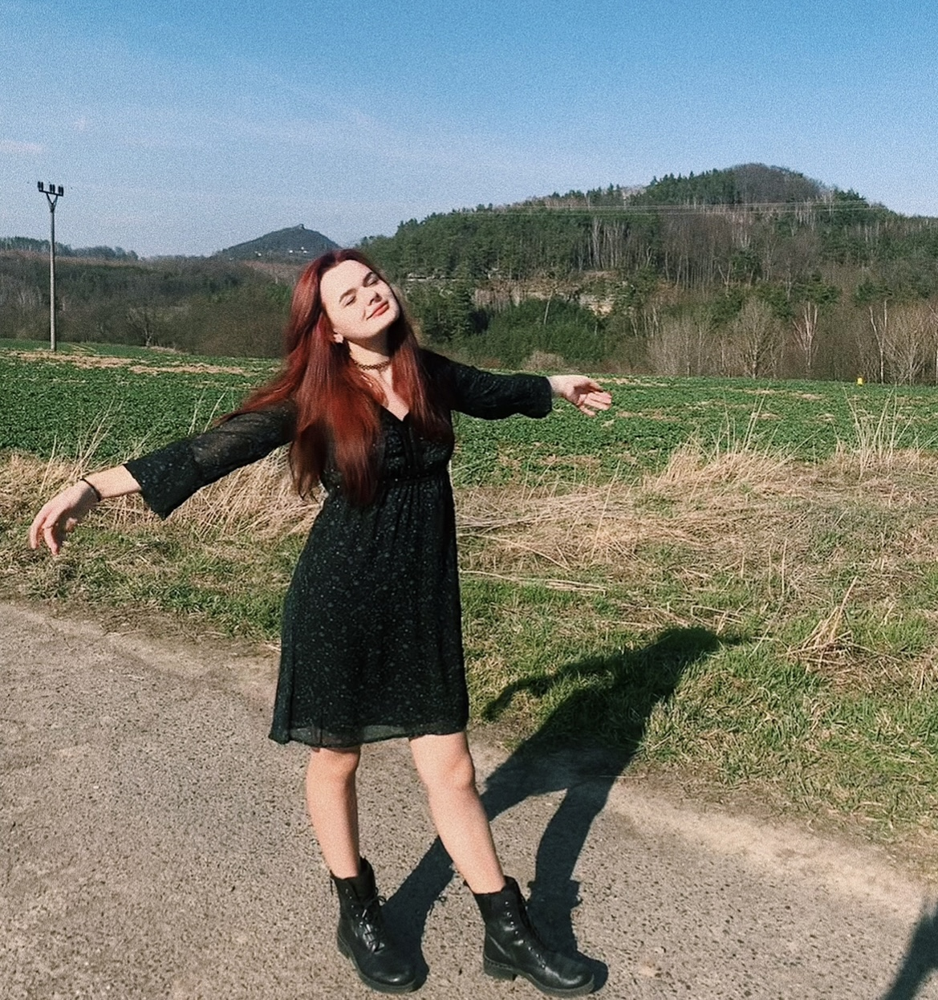

I’m a graphic designer, passionate about illustration. I study graphic design at the University of Creative Communication (VŠKK) in Prague. I’m still finding myself, so I’m excited about new experiences. Because of my calm and friendly personality, I can collaborate well in teams. I love drawing, painting, and everything that touches art. So, I would describe myself more as an artist. I’ve always been a creative individual. Since childhood, I created crazy things, extraordinary at times, even when it wasn’t my best work. But I’ve always loved it, and that’s the most important thing to me. I also love to spend time with my pets, drink too much coffee, and do group sports with friends.

