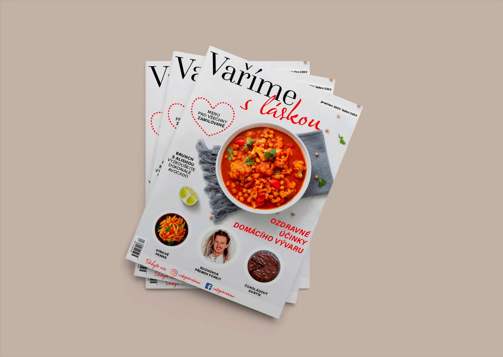
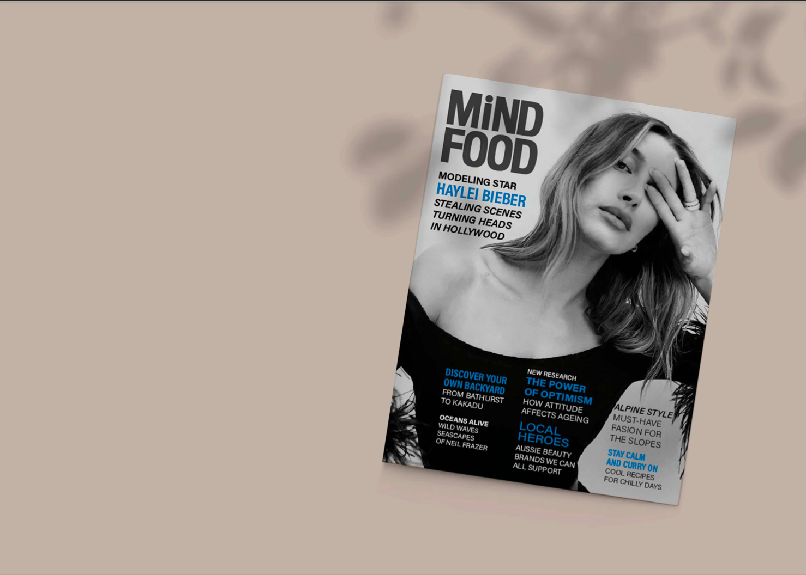
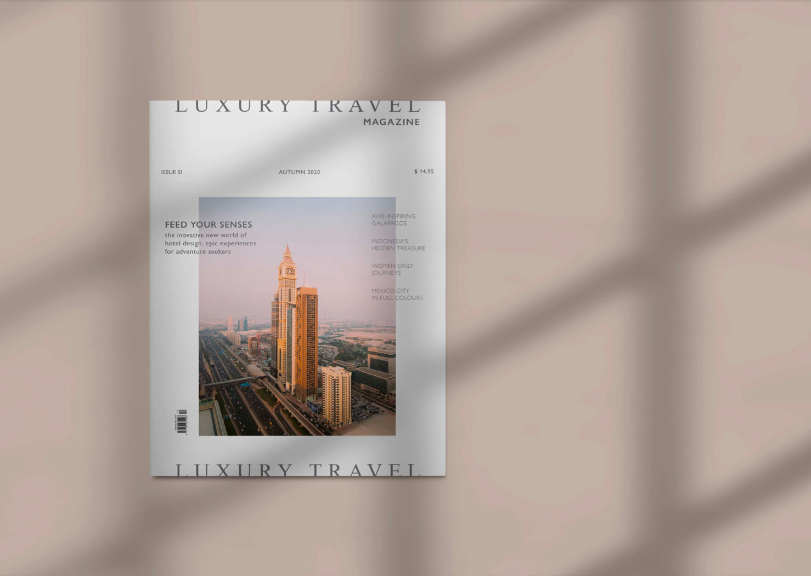

## About me

I am a graphic designer passionate about illustrations. I study at the University in Prague for graphic designer. I still kind of finding myself so I'm exited about new experiences. Because my calm and friendly personality I can cooperate really well in teams. I love drawing, painting everything what touches art a bit, so I would describe myself more like an artist. I have been always creative being. Since childhood I created crazy things and it was always something extra but sometimes it wasn't the best work. But I always loved it and that's the most important. I love to spend time with my pets, drink too much coffee and do collective sports with friends.

### Project

Redesign of three different magazine covers.
The goal was to redesign the magazine so that their cover better matched the magazine's content and price. I also tried to make the covers more attractive at first glance.

